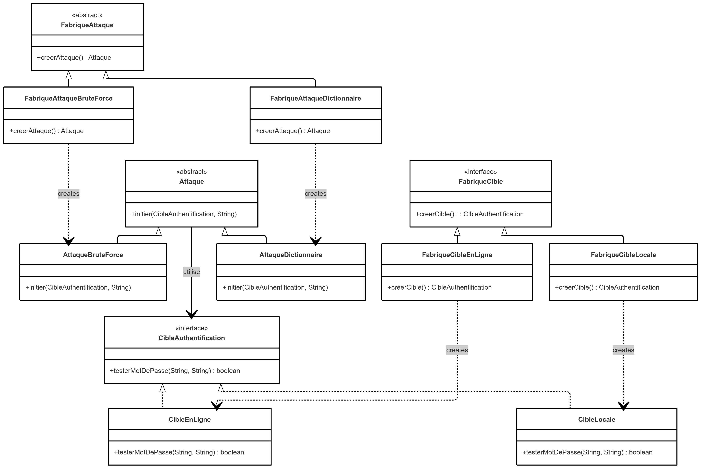

# Password Cracker - Projet de Design Pattern

## Description du Projet

Ce projet implémente un système de cassage de mots de passe éducatif en Java, démontrant deux techniques principales d'attaque : l'attaque par dictionnaire et l'attaque par force brute. L'application peut cibler des systèmes d'authentification locaux (Java) et distants (PHP via HTTP).


## Description de l'architecture

### 📁 Structure du Projet

```
passwdcracker/
├── src/
│   ├── CibleAuthentification.java          # Interface pour les cibles
│   ├── CibleLocale.java                    # Implémentation locale
│   ├── CibleEnLigne.java                   # Implémentation en ligne
│   ├── FabriqueCible.java                  # Fabrique abstraite pour les cibles
│   ├── FabriqueCibleLocale.java            # Fabrique concrète locale
│   ├── FabriqueCibleEnLigne.java           # Fabrique concrète en ligne
│   ├── Attaque.java                        # Classe abstraite des attaques
│   ├── AttaqueBruteForce.java              # Attaque par force brute
│   ├── AttaqueDictionnaire.java            # Attaque par dictionnaire
│   ├── FabriqueAttaque.java                # Fabrique abstraite pour les attaques
│   ├── FabriqueAttaqueBruteForce.java      # Fabrique concrète brute force
│   ├── FabriqueAttaqueDictionnaire.java    # Fabrique concrète dictionnaire
│   ├── CrackerApp.java                     # Point d'entrée principal
│   └── utils/                              # Utilitaires
│       ├── ConsoleUtils.java               # Affichage coloré
│       ├── FileUtils.java                  # Opérations sur fichiers
│       ├── HttpUtils.java                  # Requêtes HTTP
│       └── PasswordUtils.java              # Génération de mots de passe
├── cibles/
│   ├── Login.java                          # Cible locale (Java)
│   └── login.php                           # Cible en ligne (PHP)
├── data/
│   └── password.txt                        # Dictionnaire de mots de passe
├── web/
│   └── app/
│       ├── login.php
│       └── index.html   # Mini-site de test HTML
├── compile-improved.bat                    # Script de compilation
├── start-php-server.bat # Serveur PHP avec logs
├── test-server.bat      # Script de test manuel du serveur
└── README-AMELIORE.md                      # Ce fichier
```

### Diagramme de Classes UML


## Choix des patrons de conception utilisés et leur justification

## Explication

## Pistes d'Amélioration

- **Threading** : Implémentation multi-thread pour paralléliser les tentatives
- **Gestion mémoire** : Génération de mots de passe à la volée plutôt qu'en liste
- **Cache** : Mise en cache des résultats pour éviter les répétitions
- **Retry Logic** : Mécanisme de retry en cas d'échec réseau
- **Logging** : Système de logs détaillé pour le debug
- **Validation** : Validation plus stricte des entrées utilisateur
- **Délais** : Introduction de délais entre les tentatives
- **Détection** : Détection des mécanismes anti-brute force
- **Attaque Hybride** : Combinaison dictionnaire + variations
- **Attaque par Masque** : Utilisation de masques de mots de passe
- **Attaque Rainbow Tables** : Support des tables arc-en-ciel
- **SSH** : Attaques contre les serveurs SSH
- **FTP** : Support du protocole FTP
- **Database** : Attaques contre les bases de données
- **Fichiers de configuration** : Externalisation des paramètres
- **Profils d'attaque** : Création de profils prédéfinis
- **Interface graphique** : Développement d'une GUI
- **Vitesse** : Mesure des tentatives par seconde
- **Progression** : Indicateur de progression pour les attaques longues
- **Statistiques** : Rapport détaillé des résultats
- **Formats** : Export en JSON, XML, PDF
- **Visualisation** : Graphiques de performance
- **Historique** : Sauvegarde des résultats d'attaques


## **Comment Compiler ?**


## **Confuguration pour tester les attaques remote**
1. Installer XAMPP ou WAMP
2. Copier `cibles/login.php` dans le dossier `htdocs/app/`
3. Démarrer Apache
4. Le fichier sera accessible sur `http://localhost/app/login.php`

## **Comment Executer ?**
```bash
# Tester toutes les combinaisons
java -cp out CrackerApp bruteForce local admin
java -cp out CrackerApp bruteForce remote admin
java -cp out CrackerApp dictionnary local admin
java -cp out CrackerApp dictionnary remote admin
```


## Conclusion

Ce projet démontre l'implémentation effective de patrons de conception dans un contexte de sécurité informatique. L'architecture modulaire facilite l'extension et la maintenance, tandis que les patrons utilisés garantissent la flexibilité et la réutilisabilité du code. Les améliorations proposées permettraient de transformer ce prototype éducatif en un outil plus robuste et performant.

