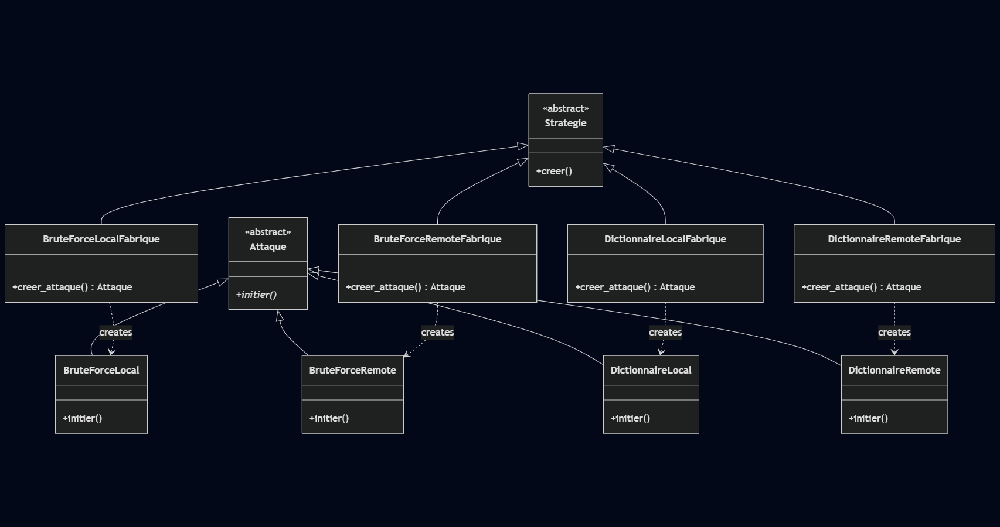

# Password Cracker - Projet de Sécurité Informatique

## Description du Projet

Ce projet implémente un système de cassage de mots de passe éducatif en Java, démontrant deux techniques principales d'attaque : l'attaque par dictionnaire et l'attaque par force brute. L'application peut cibler des systèmes d'authentification locaux (Java) et distants (PHP via HTTP).

### Diagramme de Classes UML

#### Factory method

#### Abstarct Factory

### Choix des patrons de conception utilisés et leur justification

### Explication des variantes implémentées.

## Pistes d'Amélioration

### 1. Implémentation et Fonctionnalités

#### Optimisation des Performances
- **Threading** : Implémentation multi-thread pour paralléliser les tentatives
- **Gestion mémoire** : Génération de mots de passe à la volée plutôt qu'en liste
- **Cache** : Mise en cache des résultats pour éviter les répétitions

### 2. Sécurité et Robustesse

#### Gestion d'Erreurs Améliorée
- **Retry Logic** : Mécanisme de retry en cas d'échec réseau
- **Logging** : Système de logs détaillé pour le debug
- **Validation** : Validation plus stricte des entrées utilisateur

#### Rate Limiting
- **Délais** : Introduction de délais entre les tentatives
- **Détection** : Détection des mécanismes anti-brute force

### 3. Architecture et Extensibilité

#### Nouveaux Types d'Attaques
- **Attaque Hybride** : Combinaison dictionnaire + variations
- **Attaque par Masque** : Utilisation de masques de mots de passe
- **Attaque Rainbow Tables** : Support des tables arc-en-ciel

#### Support de Protocoles Additionnels
- **SSH** : Attaques contre les serveurs SSH
- **FTP** : Support du protocole FTP
- **Database** : Attaques contre les bases de données

#### Configuration Externalisée
- **Fichiers de configuration** : Externalisation des paramètres
- **Profils d'attaque** : Création de profils prédéfinis
- **Interface graphique** : Développement d'une GUI

### 4. Monitoring et Reporting

#### Métriques de Performance
- **Vitesse** : Mesure des tentatives par seconde
- **Progression** : Indicateur de progression pour les attaques longues
- **Statistiques** : Rapport détaillé des résultats

#### Génération de Rapports
- **Formats** : Export en JSON, XML, PDF
- **Visualisation** : Graphiques de performance
- **Historique** : Sauvegarde des résultats d'attaques

### 5. Considérations Éthiques et Légales

#### Avertissements et Limitations
- **Usage éducatif** : Clarification de l'usage purement éducatif
- **Autorisations** : Vérification des autorisations avant utilisation
- **Responsabilité** : Clauses de non-responsabilité

## Conclusion

Ce projet démontre l'implémentation effective de patrons de conception dans un contexte de sécurité informatique. L'architecture modulaire facilite l'extension et la maintenance, tandis que les patrons utilisés garantissent la flexibilité et la réutilisabilité du code. Les améliorations proposées permettraient de transformer ce prototype éducatif en un outil plus robuste et performant.

---

**Note importante** : Ce projet est destiné uniquement à des fins éducatives et de recherche en sécurité. Toute utilisation à des fins malveillantes est strictement interdite et peut être illégale.